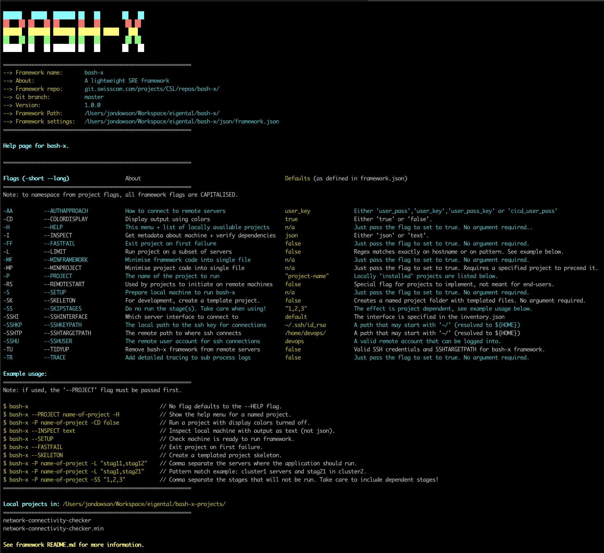

{height=800 width=750}
***
  
***
<a name="M"></a>
# Menu:   

| 0   | [About](#AB)                       |                                                                                                                    |
|-----|------------------------------------|--------------------------------------------------------------------------------------------------------------------|
| 1   | [Setup](#SU)                       |                                                                                                                    |
| 2   | [Versions](#VS)                    |                                                                                                                    |
| 3   | [SRE consumers](#SREC)             |                                                                                                                    |
| 4   | [SRE developers](#SRED)            |                                                                                                                    |


<a name="AB"></a>
## About   

***

Bash-x is a lightweight framework for running and creating SRE applications.    
It provides the SRE-consumer with a range of 'projects' that are easily configurable for their environments and needs.   
It enables  the SRE-developer to rapidly create any data-driven workflow.    
         
Bash-x can be run from any linux machine but is best integrated as part of a Jenkins / Gitlab pipeline.    

Setup is simple (see below) and the only dependency is the jq json parsing library.    
Both the jq library and the single file bash-x framework are copy and pastable.    
As such, even if git or repo connectivity is missing, any environment can benefit from this lightweight and extremely portable toolkit.    

***

[Menu](#M) 
<a name="SU"></a>
## Setup

```bash
# [1] Get bash-x.    

$ git clone ssh://git@git.swisscom.com:7999/csl/bash-x.git

# [2] Setup bash-x.

$ cd bash-x    
$ chmod +x bash-x    
$ ./bash-x --SETUP

# [3] Apply the updated bash_profile.
$ source ~/.bash_profile

# [4] For SRE-consumers.

# Get a bash-x project.
# In the parent folder to bash-x, git clone the required project folder.
$ cd ..

# Note - this url is the main project repo but a bash-x project could be in a different repo. 
$ git clone ssh://git@git.swisscom.com:7999/csl/bash-x-projects.git    
# Follow the setup instructions in the bash-x project's README.     

# [5] For SRE-developers.

# See developer section below on how to create your own bash-x projects!

```    
***

[Menu](#M) 
<a name="VS"></a>
## Versions    

Each version with hash is recorded in the following table.    
The master branch always has the latest stable version and older versions are added to their own branch.    

```bash
# Run this command locally to verify the integrity of the minimised framework file.     
$ sha256sum bash-x
```

| #   | Version Number                     | sha-256sum                                                                                                         |
|-----|------------------------------------|--------------------------------------------------------------------------------------------------------------------|
| 1   | 1.0.0                              | 7106321a1213767860a7390cc646a4855a72c0d0553ca96b9bbdf95f1a152c9a                                                   |

***

[Menu](#M) 
<a name="SREC"></a>
## SRE Consumers     

On its way!!

***

[Menu](#M) 
<a name="SRED"></a>
## SRE Developers   

On its way!    